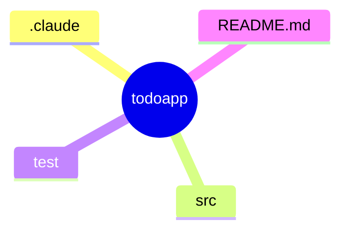

# RULE

## ディレクトリ構成

## パッケージャー

- uv

## コード規約

- `The Zen of Python`（REPLで、`import this`で表示される）と[PEP8](https://pep8-ja.readthedocs.io/ja/latest/)とする
- 型ヒント記述とする
  - すべての関数には、型引数、戻り値を指定すること
-  型ヒントはmypyで、検証する
-  コメントの説明は、多くても3行以内にすること

## テスト

### Unit Test

- Pytest

### カバレッジ

- pytest-cov

### 型ヒント

- mypy

## 現在の状況記録と、業務の再開について

- `現在の作業を記録して`で、現在の作業状況を`.claude/MEMORY.md`に要約保存する
- 引き継ぎ資料は作成する
- `業務再開して`または、`開始`で`状況記録`を確認する